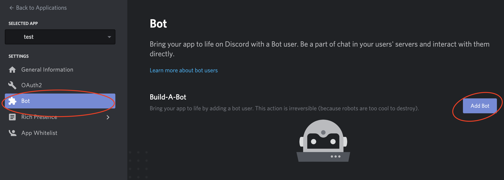
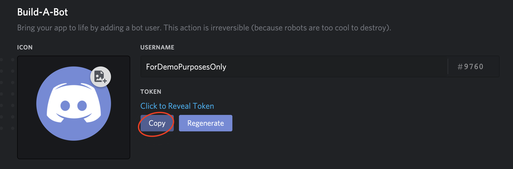
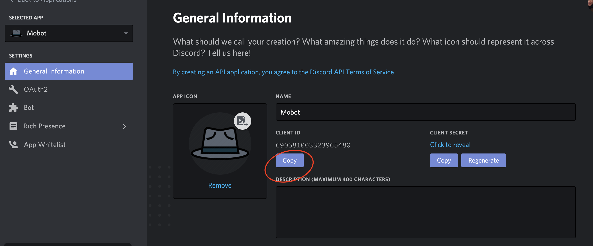
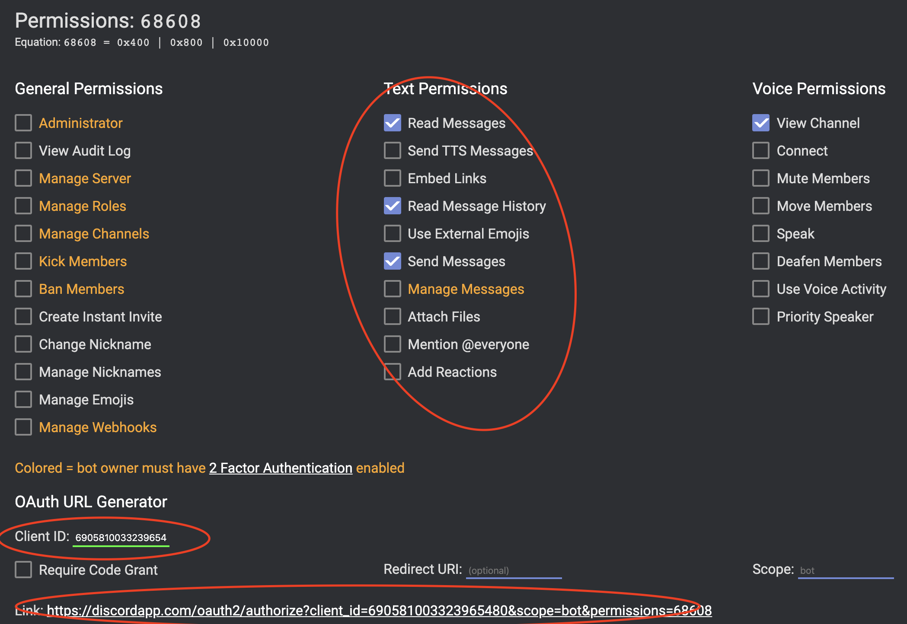
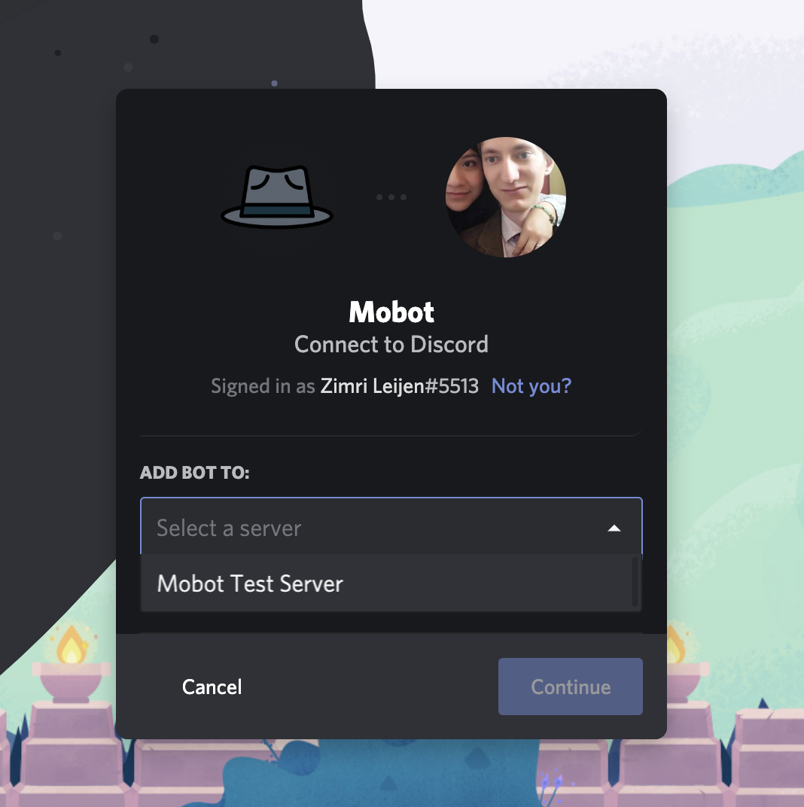

# Mobbot by zimmah
## created originally for &lt;/salt&gt; winter20ams
-----------------------------------------------------
## Table of contents
1. intro
    * [What is my purpose?](#What-is-my-purpose)
    * [What can Mobbot do?](#What-can-Mobbot-do)
2. [How to use?](#How-to-use)
    * [Starting the mob session](#starting-the-mob-session)
    * [Restarting the mob session](#restarting-the-mob-session)
    * [Stopping/Resuming the mob session](#stopping/resuming-the-mob-session)
    * [Breaks](#breaks)
    * [Away/Return](#away-/-return)
    * [Skipping](#skipping)
    * [Using the buffer](#using-the-buffer)
    * [Pinning a message](#pinning-a-message)
3. [How to add Mobbot to your server?](#how-to-add-mobbot-to-your-server)
    * [Adding Mobbot to your server](#adding-the-bot-to-your-server)
    * [Configuring Mobbot](#configuring-mobbot)
4. [How to run your own instance of Mobbot](#how-to-run-your-own-instance-of-Mobbot)
    * [Creating a discord bot account](#creating-a-discord-bot-account)
    * [Adding it to your server](#adding-it-to-your-server)
    * [Configuring it](#configuring-it)
    * [Running it](#running-it)

## What is my purpose?
* Assist with remote mobbing
* Fun after-school excercise to create and maintain the bot

## What can Mobbot do?
* Keep track of mob timers and break timers
* Keep track of buffers
* Whatever you want me to do, if you update the code youself or suggest edits.
* Will not make your homework for you.

# How to use?
In this guide `<?name>` means an optional setting while `<name>` means a mandatory argument.    
Arguments are space seperated.    
The Mobbot will not respond to any commands outside the mob channels, with the exception of `init`.    
Type `help` to show the Mobbot commands in chat. 

## Starting the mob session
Type `start` in your mob channel.   
This will start a new mob session with default settings. (3 rounds of 20 minutes, randomized order of active mob members).

Optional settings:   
`start <?rounds> <?round time> <?order of names seperated by spaces>`    
* **rounds:** the number of rounds before a break
* **round time:** the time for each round in minutes
* **order:** @mentions of mob members in the order that you want
(leave blank to randomize all active mob members)

Example:    
`start 4 15 @Alice @Bob @Charlie`    
Will start a mob session with 4 rounds of 15 minutes each, with Alice as the first driver, followed by Bob, followed by Charlie, and then again Alice.

Note:    
make sure to @mention the members, or else the bot won't know who you mean.

## Restarting the mob session
Type `restart <?rounds> <?round time> <?order>` to force start a new mob session.    
This will behave exactly like `start`, except it will not resume a previous session, but instead force a new one.     
If no order is specified, start will resume with the last known order, while restart will randomize the order.

## Stopping / resuming the mob session
Type `stop` to stop the mob timer.     
Type `(re)start` or react to the stop message with a 👍 to continue where you left off (every active mob member needs to react).    
Reactions are the preffered method to make sure everyone is ready.

## Breaks
Type `break` to start a 10 minute break.      
Type `(re)start` or react to the stop message with a 👍 to continue where you left off (every active mob member needs to react).   
Reactions are the preffered method to make sure everyone is ready.   

### Optional settings

* **time:** break time in minutes
* **message:** message to be displayed after break is over

Type `break <?time> <?message>` to have a break of a different length.     
The message will show up after the break ends. This will help remind you what you did before the break, to allow you to continue where you left off.

## Away / return
Type `away <?name>` to mark a mob member as away. This member will be excluded from the list of names when mobbing.      
Type `return <name>` to mark a mob member as returned.      
Both `away` and `return` accept multiple names (space seperated).     
Typing `away` without a name will show you the list of mob members marked as away.

## Skipping
Type `skip` to skip the current driver   
Using `skip` during the break will skip the break (it behaves like start in that case).

## Using the buffer
Type `buffer` to view the buffer    
Type `buffer add <message>` to add a message to the buffer.     
Type `buffer remove <id>` to remove a message from the buffer. alias: `buffer delete <id>`     
Type `buffer clear` to erase the buffer.

## Pinning a message
React 📌 to the message you want to pin, the bot wil pin it for you.
To unpin it, simply remove the 📌 reaction.

# How to add Mobbot to your server?
## Adding the bot to your server
Follow [this link](https://discord.com/api/oauth2/authorize?client_id=690581003323965480&permissions=3213312&scope=bot) to add Mobbot to your server.

## Configuring Mobbot
Mobbot is set up to self-configure, however, to work correctly, it is important that the following steps are followed.

* Ensure the bot is assigned the role of each mob in the server. This way the bot will know which mobs to listen to.
* Ensure the mob names and the mob channel names correspond. The bot is set up to ignore chat outside of mob channels, therefore it will ignore chat in channels it doesn't recognize.
* Ensure the mobs members are assigned to the correct mob. Mobbot will scan the roles and their members by role to be able to recognize the mobs.
* Once all above steps are done, type `init` in any discord server where Mobbot is present. Mobbot will now scan for mobs and their members, and will listen to the channels assigned to those mobs. This will work accross all servers Mobbot is invited to.

**NOTE** you need to have a role with admin permissions assigned to yourself if you want to use the `init` command.

That's all, simple right?

# How to run your own instance of Mobbot?
**Note, this is optional, you can simply run the one hosted on heroku by following the steps above**

## Creating a discord bot account

Create a new discord application [here](https://discordapp.com/developers/applications) and add a bot to that application.    
   

Once you have the bot, copy the token and create a `.env` file in the root of the project, then write `TOKEN=paste-your-unique-bot-token-here`.


## Adding it to your server
Copy the ID of your application client


go to [this link](https://discordapi.com/permissions.html#68608), make sure the correct permissions are applied, and copy your Client ID in the bottom.
After that, follow the generated link.


Finally, confirm that you want to connect the bot to your server.
 

## Configuring it
The bot is set up to self-configure, however, to work correctly, it is important that the following steps are followed.

make sure to have a `.env` with the following format in the root folder:

```js
`TOKEN=paste-your-unique-bot-token-here`
```

* Ensure the bot is assigned the role of each mob in the server. This way the bot will know which mobs to listen to.
* Ensure the mob names and the mob channel names correspond. The bot is set up to ignore chat outside of mob channels, therefore it will ignore chat in channels it doesn't recognize.
* Ensure the mobs members are assigned to the correct mob. Mobbot will scan the roles and their members by role to be able to recognize the mobs.
* Once all above steps are done, type `init` in any discord server where Mobbot is present. Mobbot will now scan for mobs and their members, and will listen to the channels assigned to those mobs. This will work accross all servers Mobbot is invited to.

Please add a cool image to Mobbot to give it some identity

## Running it
Clone this repo and `npm i`

Run the bot with `npm run start`
